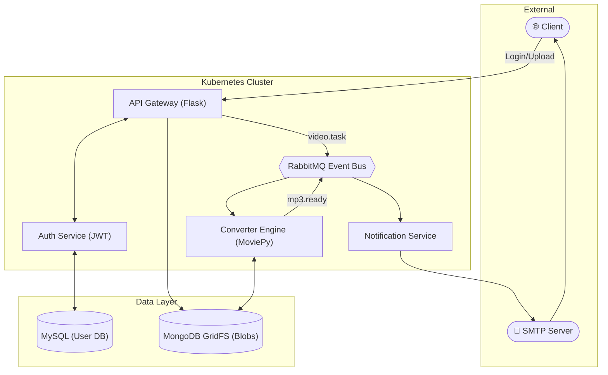

  <h1 align="center">Distributed Media Processing Pipeline</h1>
  
  

    A production-grade, fault-tolerant microservices architecture for asynchronous video-to-audio conversion at scale.
  

  

    
    
    
    
    
    
    
  

A cloud-native, event-driven microservices architecture designed for asynchronous video-to-audio conversion. This project demonstrates proficiency in **decoupled system design, message-oriented middleware, and resilient infrastructure orchestration**.

---

## 🏗️ System Architecture

The system leverages an asynchronous orchestration model to ensure high availability and prevent cascading failures during CPU-intensive media processing.

---

## 🧠 Engineering Principles & Design Decisions

### 1. Asynchronous Decoupling via Message-Oriented Middleware
- **Problem**: Media conversion is a CPU-bound operation. Processing it within the request-response cycle would lead to socket exhaustion and HTTP 504 timeouts.
- **Solution**: Implemented an **Event-Driven Architecture (EDA)** using RabbitMQ. The Gateway offloads heavy lifting to background workers immediately after a successful upload.
- **Result**: Decoupled the ingestion layer from the processing layer, allowing for independent horizontal scaling of workers based on queue depth.

### 2. Distributed Large Object Management (GridFS)
- **Problem**: Storing large `.mp4` payloads in local Kubernetes ephemeral storage risks Pod evictions due to disk pressure. Relational databases are not optimized for multi-gigabyte BLOBs.
- **Solution**: Leveraged **MongoDB GridFS** to shard large media files into manageable **255KB chunks**. 
- **Result**: Enabled **O(1) memory usage** during processing; the system streams chunks from the database rather than loading entire files into RAM.

### 3. Stateless Identity Management
- **Problem**: Traditional session management creates tight coupling between the client and the Auth database, adding I/O overhead to every request.
- **Solution**: Implemented **JWT (JSON Web Tokens)** for stateless authorization. 
- **Result**: The API Gateway validates identity claims algorithmically by verifying cryptographic signatures, minimizing database hits and eliminating the need for sticky sessions.

### 4. Fault Tolerance & Message Reliability
- **Durable Message Delivery**: Configured RabbitMQ with **persistent message delivery** and manual acknowledgments (ACKs). 
- **Error Handling**: Implemented **NACK/Requeue** logic. If a Converter pod is interrupted, the task is returned to the queue, minimizing the risk of lost tasks during system instability.
- **Data Integrity**: Integrated compensating transactions to delete orphaned GridFS records if a downstream message broadcast fails.

---

## 📊 Technical Stack
- **Language**: Python (Flask)
- **Broker**: RabbitMQ (AMQP)
- **Databases**: MySQL (Metadata), MongoDB GridFS (Storage)
- **Orchestration**: Kubernetes (Minikube/kubectl)
- **Containerization**: Docker

---

## 🧪 Testing & Validation Roadmap
*While current deployment is managed via Kubernetes manifests, the following testing strategy is designed for the codebase:*
- **Unit Testing**: Isolated logic testing for JWT signing, GridFS chunking, and conversion utility functions.
- **Integration Testing**: Validating the end-to-end flow from Gateway upload to RabbitMQ task emission.
- **Resilience Testing**: Simulating worker pod failures to verify RabbitMQ message requeuing.

---

## 🏁 Getting Started
Detailed deployment manifests and environment configuration can be found in the [Setup & Installation Guide](./setup.md).

---
*Developed as a deep-dive into distributed systems and microservices orchestration.*
